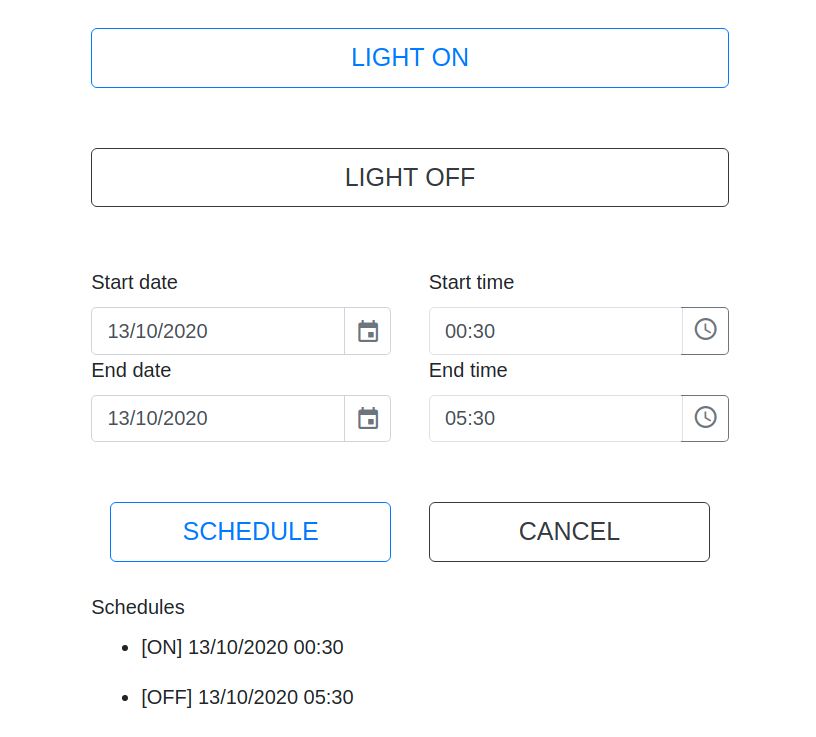

# light-service

## Control lights with Java, Python and Raspberry pi:

**Light ON**

**Light OFF**

**Schedule**

**TODO:** How to build solutions. Hardware and Software.

## Start Java app on boot

```
crontab -e
```

Add the line below

```
@reboot java -jar /home/pi/light-service.jar > log.txt &
```

## Access

http://localhost:8080/


